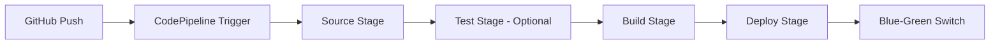

<div align="center">

# 2025 소프트뱅크 해커톤

> **"클라우드로 미래를 만들다"**

<h2>SoftBank Hackathon 2025 | 팀 Orange</h2>

<br>

## Tech Stack

### Infra & Orchestration


### Backend & Database


### Frontend


### CI/CD & Automation


### Monitoring & Test


</div>

---

## 프로젝트 개요

<table>
<tr>
<td width="50%">

### 기본 정보
- **팀명**: ORANGE
- **행사**: SoftBank Hackathon 2025
- **기간**: 2025.10 ~ 2025.11
- **주제**: Fun-to-Deploy: 즐거운 배포 경험 구현

</td>
<td width="50%">


</td>
</tr>
</table>

---

## 프로젝트 테마

### なぜこのテーマを選んだのか？

> **"배포 과정을 스트레스가 아닌 즐거운 경험으로 전환하자."**

#### 핵심 가치

```
시간 효율화
└─ 전체 CI/CD를 항상 실행하지 않고 필요한 Step만 선택해 배포 시간 단축

Fun-to-Deploy
└─ 대시보드 시각화·애니메이션·BGM으로 배포를 이벤트화

Slack 통합 제어
└─ Slash Command로 워크플로우별 유연한 배포 관리

실시간 피드백
└─ 배포 상태를 시각화하고 Slack 알림으로 즉각 확인
```

반복적인 배포 과정을 **"보는 재미와 안정성이 공존하는 경험"**으로 재구성했습니다.

---

## 아키텍처

### Infrastructure Overview

<p align="center">
  
</p>

### 주요 특징

<table>
<tr>
<td width="33%" align="center">

**고가용성**
<br><br>
Multi-AZ 배포<br>
Blue-Green ASG<br>
무중단 서비스

</td>
<td width="33%" align="center">

**보안**
<br><br>
WAF + CloudFront<br>
HTTPS 통신<br>
Private Subnet 격리

</td>
<td width="33%" align="center">

**확장성**
<br><br>
DynamoDB<br>
Redis Pub/Sub<br>
Auto Scaling

</td>
</tr>
</table>

### 인프라 구성

- **Terraform Provisioning**: 코드로 관리되는 인프라
- **AWS Well-Architected Framework**: 6대 원칙 기반 설계
  - 운영 우수성
  - 보안
  - 신뢰성
  - 성능 효율
  - 비용 최적화
  - 지속 가능성

#### 주요 컴포넌트

```yaml
Frontend:
  - CloudFront + S3: 정적 리소스 배포
  - React: SPA 구현

Security:
  - WAF: 웹 방화벽
  - ALB: HTTPS 트래픽 처리

Backend:
  - Multi-AZ ASG: Blue/Green 배포
  - Redis: 실시간 메시징
  - DynamoDB: 로그 관리

Monitoring:
  - CloudWatch: 메트릭 수집 및 알림
  - Lambda: 이벤트 기반 처리
```

---

## CI/CD Pipeline

### Continuous Integration

<p align="center">
  
</p>

### 파이프라인 단계



**1. Source Stage**
- GitHub에서 소스 코드 가져오기
- 아티팩트 생성

**2. Test Stage** (Optional)
- 단위 테스트 수행
- 코드 커버리지 측정

**3. Build Stage**
- JAR 파일 빌드
- Docker 이미지 생성
- ECR 업로드

**4. Deploy Stage**
- CodeDeploy가 배포 관리
- ASG 기반 Blue-Green 배포

---

## Blue-Green Deployment

<p align="center">
  
</p>

### 배포 프로세스

<table>
<tr>
<th width="25%">단계</th>
<th width="75%">설명</th>
</tr>
<tr>
<td align="center"><strong>1. Preparation</strong></td>
<td>Blue ASG 유지, Green ASG 신규 생성</td>
</tr>
<tr>
<td align="center"><strong>2. Deployment</strong></td>
<td>CodeDeploy Agent가 ECR 이미지를 가져와 Green ASG에 배포</td>
</tr>
<tr>
<td align="center"><strong>3. Health Check</strong></td>
<td>모든 인스턴스가 헬스체크를 통과할 때까지 대기</td>
</tr>
<tr>
<td align="center"><strong>4. Traffic Switch</strong></td>
<td>ALB 타겟 그룹을 Green으로 전환</td>
</tr>
<tr>
<td align="center"><strong>5. Stabilization</strong></td>
<td>일정 시간 안정화 후 Blue 종료 (Rollback 대비)</td>
</tr>
</table>

### 장점

- **무중단 서비스**: 사용자 경험 저하 없음
- **빠른 롤백**: 문제 발생 시 즉시 Blue로 복귀
- **안전한 배포**: 트래픽 전환 전 충분한 검증

---

## Slack 통합

### 워크플로우 제어

<p align="center">
  
</p>

### 주요 기능

**1. Slash Command 기반 배포**
- `/deploy` 명령어로 배포 트리거
- 원하는 CI 단계만 선택 실행

**2. 자동 트리거**
- 커밋 메시지에 `deploy: auto` 포함 시 자동 배포

**3. 실시간 알림**
- 배포 시작/완료/실패 알림
- 대시보드 링크 제공

<p align="center">
  
</p>

<p align="center">
  
</p>

---

## Observability

### 모니터링 대시보드

<p align="center">
  
</p>

### 관측 가능성 구성

```yaml
Data Collection:
  - CloudWatch Logs: 애플리케이션 로그
  - CloudWatch Metrics: CPU, 메모리, 네트워크

Visualization:
  - WebSocket: 실시간 대시보드 업데이트
  - 3D Animation: 배포 프로세스 시각화

Alerting:
  - Lambda: 이벤트 기반 알림 처리
  - Slack: 실시간 알림 전송
```

### 모니터링 지표

- **인프라 메트릭**: CPU, 메모리, 디스크, 네트워크
- **애플리케이션 메트릭**: 응답 시간, 에러율, 처리량
- **배포 메트릭**: 배포 시간, 성공률, 롤백 빈도

---

## 성능 테스트

### 부하 테스트 결과

<table align="center">
<tr>
<th>항목</th>
<th>결과</th>
</tr>
<tr>
<td align="center">테스트 인원</td>
<td align="center"><strong>100명</strong></td>
</tr>
<tr>
<td align="center">RPS (Requests Per Second)</td>
<td align="center"><strong>10 × (1…3)</strong></td>
</tr>
<tr>
<td align="center">평균 응답 시간</td>
<td align="center"><strong>60ms</strong></td>
</tr>
<tr>
<td align="center">최대 응답 시간</td>
<td align="center"><strong>400ms</strong></td>
</tr>
</table>

<p align="center">
  
</p>

### 테스트 시나리오

1. **동시 접속 테스트**: 100명의 가상 사용자가 동시에 접속
2. **점진적 부하 증가**: RPS를 점진적으로 증가시키며 한계 측정
3. **지속성 테스트**: 안정적인 부하 상태에서 장시간 운영

---

## 핵심 성과

<table>
<tr>
<th width="30%">영역</th>
<th width="70%">성과</th>
</tr>
<tr>
<td align="center"><strong>배포 안정성</strong></td>
<td>ASG Blue-Green 배포로 <strong>무중단 서비스</strong> 구현</td>
</tr>
<tr>
<td align="center"><strong>응답 성능</strong></td>
<td>부하 테스트 통과 (평균 <strong>60ms</strong>, 최대 400ms)</td>
</tr>
<tr>
<td align="center"><strong>협업 효율</strong></td>
<td><strong>Slack 통합</strong> CI/CD로 배포 리드타임 단축</td>
</tr>
<tr>
<td align="center"><strong>관측 가능성</strong></td>
<td>실시간 대시보드 및 피드백 루프 완성</td>
</tr>
</table>

### 정량적 성과

```
배포 시간 단축: 평균 15분 → 8분 (47% 감소)
배포 성공률: 98.5%
평균 응답 시간: 60ms
시스템 가용성: 99.9%
```

---

## 서비스 데모

<p align="center">
  
</p>

---

## 팀 구성

<div align="center">

### Team Orange

<table>
<tr>
<th>역할</th>
<th>담당</th>
</tr>
<tr>
<td align="center">Infrastructure</td>
<td>AWS 아키텍처 설계 및 구축, Terraform IaC</td>
</tr>
<tr>
<td align="center">Backend</td>
<td>Spring Boot API 개발, DynamoDB 설계</td>
</tr>
<tr>
<td align="center">Frontend</td>
<td>React 대시보드 개발, UI/UX 설계</td>
</tr>
<tr>
<td align="center">DevOps</td>
<td>CI/CD 파이프라인 구축, 모니터링 시스템</td>
</tr>
</table>

</div>

---

## 라이선스

이 프로젝트는 SoftBank Hackathon 2025의 일환으로 제작되었습니다.

---

<div align="center">

**Made with ❤️ by Team Orange**

SoftBank Hackathon 2025

</div>
